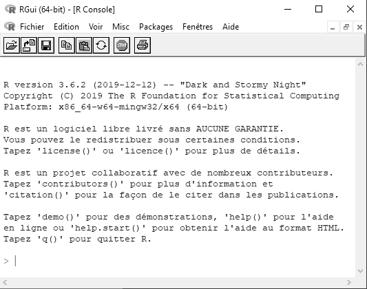

# (PART) Concepts de base {-}

# Premiers pas {#premiersPas}

## Installation de R

Le logiciel R peut être téléchargé depuis cette page : https://www.r-project.org/. Sur le site de R il faut au préalable choisir un mirroir CRAN (serveur depuis lequel télécharger R ; sauf cas particulier le plus proche de sa localisation géographique), puis télécharger le fichier *base*. Les utilisateurs de Linux pourront préférer un `sudo apt-get install r-base`. 

```{block, type='rmdnote'}
Le logiciel R peut être téléchargé depuis de nombreux serveurs du CRAN (Comprehensive R Archive Network) à travers le monde. Ces serveurs s'appellent des miroirs. Le choix du miroir est manuel. Les informations complémentaires comme cette note seront toujours représentées avec ce pictogramme *information*.
```

## R comme calculatrice

Une fois le programme lancé, une fenêtre apparaît dont l'aspect peut varier en fonction de votre système d'exploitation (Figure \@ref(fig:screenCapConsole)). Cette fenêtre est dénommée la *console*.

```{r screenCapConsole, fig.cap = "Capture d'écran de la console R sous Windows.\\label{fig:screenCapConsole}", echo = FALSE}

```

La console correspond à l'interface où va être interprété le code, c'est à dire à l'endroit où le code va être transformé en langage machine, éxécuter par l'ordinateur, puis retransmis sous une forme lisible par des humains. Cela correspond à l'écran d'affichage d'une calculatrice. C'est de cette manière que R va être utilisé dans la suite de cette section.

```{r}
5 + 5
```

Si nous écrivons `5 + 5` dans la console puis `Entrée`, le résultat apparaît précédé du chiffre [1] entre crochets. Ce chiffre correspond au numéro du résultat (dans notre cas, il n'y a qu'un seul résultat ; nous reviendrons sur cet aspect plus tard). Nous pouvons également noter dans cet exemple l'utilisation d'espaces avant et après le signe `+`. Ces espaces ne sont pas nécessaires mais permettent au code d'être plus lisible par les humains (i.e., plus agréable à lire pour nous comme pour les personnes avec qui nous serons amenés à partager notre code). 
Les opérateurs aritmétiques disponibles sous R sont résumés dans la table \@ref(tab:tabOpAri).

```{r tabOpAri, echo = FALSE}
opAriDf <- data.frame(Label = c("Addition", "Soustraction", "Multiplication", 
  "Division", "Puissance", "Modulo", "Quotien Décimal"), 
  Operateur = c("+", "-", "*", "/", "^", "%%", "%/%"))
knitr::kable(opAriDf, caption = "Opérateurs arithmétiques.\\label{tab:tabOpAri}")
```

Classiquement, les multiplications et les divisions sont prioritaires sur les additions et les soustractions. Au besoin nous pouvons utiliser des parenthèses.

```{r}
5 + 5 * 2
(5 + 5) * 2
```

L'opérateur modulo correspond au  reste de la division euclidienne. Il est souvent utilisé en informatique par exemple pour savoir si un nombre est pair ou impair (un nombre modulo 2 va renvoyer 1 si il est impair et 0 si il est pair).

```{r}
451 %% 2
288 %% 2
(5 + 5 * 2) %% 2
((5 + 5) * 2) %% 2
```

R intègre également certaines constantes dont `pi`. Par ailleurs le signe infini est représenté par `Inf`

```{r}
pi
pi * 5^2
1/0
```

```{block, type='rmdstyle'}
le *style* du code est important car le code est destiné à être lisible par nous plus tard et par d'autres personnes de manière générale. Pour avoir un style lisible il est recommandé de mettre des espaces avant et après les opérateurs arithmétiques. Les informations concernant le *style* seront toujours représentées avec ce pictogramme afin qu'elles soient facilement identifiables.
```

## La notion d'objet

Un aspect important de la programmation avec R, mais aussi de la programmation en général est la notion d'objet. Comme indiqué sur la page web de wikipedia (https://fr.wikipedia.org/wiki/Objet_(informatique)), en informatique, un objet est un *conteneur*, c'est à dire quelque chose qui va contenir de l'information. L'inforamtion contenue dans un objet peut être très diverse, mais pour le moment nous allons contenir dans un objet le chiffre 5. Pour ce faire (et pour pouvoir le réutiliser par la suite), il nous faut donner un nom à notre objet. Avec R le nom des objets ne doit pas comprendre de caractères spéciaux comme *^$?|+()[]}{*, ne doit pas commencer par un chiffre ni contenir d'espaces. Le nom de l'objet doit être représentatif de ce qu'il contient, tout en étant ni trop court ni trop long. Imaginons que notre chiffre 5 corresponde au nombre de répétitions d'une expérience. Nous voudrions lui donner un nom faisant référence à *nombre* et à *répétition*, que nous pourrions réduire à *nbr* et *rep*, respectivement. Il existe plusieurs possibilités qui sont toutes assez répandues sous R : 

* la séparation au moyen du caractère *tiret bas* :  `nbr_rep`
* la séparation au moyen du caractère *point* : `nbr.rep`
* l'utilisation de lettres minuscules : `nbrrep`
* le style *lowerCamelCase* consistant en un premier mot en minuscules et des suivants avec une majuscule : `nbrRep`
* le style *UpperCamelCase* consistant à mettre une majuscule au début de chacun des mots : `NbrRep`

Toutes ces formes de nommer un objet sont équivalentes. Dans ce livre nous utiliserons le style *lowerCamelCase*. De manière générale il faut éviter les noms trop longs comme `leNombreDeRepetitions` ou trop courts comme `nR`, et les noms ne permettant pas d'identifier le contenu comme `maVariable` ou `monChiffre`, mais aussi `a` ou `b`...

```{block, type='rmdstyle'}
Il existe différentes façons de définir un nom pour les objets que nous allons créer avec R. Dans ce livre il est utilisé le style *lowerCamelCase*. L'important n'est pas le choix du style mais la consistence dans son choix. L'objectif est d'avoir un code fonctionnel mais également un code facile et agréable à lire.
```

Maintenant que nous avons choisi un nom pour notre objet, il faut le créer et faire comprendre à R que notre objet doit contenir le chiffre 5. Il existe trois façons de créer un objet sous R:

* avec le signe `<-`
* avec le signe `=`
* avec le signe `->`

```{r}
nbrRep <- 5
nbrRep = 5
5 -> nbrRep
```

Dans ce livre nous utiliserons toujours la forme `<-` par souci de consistence et aussi parce que c'est la forme la plus répendue.

```{r}
nbrRep <- 5
```

Nous venons de créer un objet `nbrRep` et de lui affecter la valeur 5. Cet objet est désormais disponible dans notre environnement de calcul et peut donc être utilisé. Voici quelques exemples :

```{r}
nbrRep + 2
nbrRep * 5 - 45/56
pi * nbrRep^2
```

La valeur associée à notre objet `nbrRep` peut être modifiée de la même manière que lors de sa création :

```{r}
nbrRep <- 5
nbrRep + 2
nbrRep <- 10
nbrRep + 2
nbrRep <- 5 * 2 + 7/3
nbrRep + 2
```

L'utilisation des objets prend tout son sens lorsque nous avons des opérations complexes à réaliser et rend le code plus agréable à lire et à comprendre. 

```{r}
(5 + 9^2 - 1/18) / (32 * 45/8 + 3)
terme01 <- 5 + 9^2 - 1/18
terme02 <- 32 * 45/8 + 3
terme01 / terme02
```

## Les scripts

R est un langage de programmation souvent dénommé *langage de script*. Cela fait référence au fait que la plupart des utilisateurs vont écrire des petits bouts de code plutôt que des programmes entiers. R peut être utilisé comme une simple calculatrice, et dans ce cas il ne sera pas nécessaire de conserver un historique des opérations qui ont été réalisées. Mais si les opérations à réliser sont longues et complexes, il peut devenir nécessaire de pouvoir sauvegarder ce qui a été fait à un moment donné pour pouvoir poursuivre plus tard. Le fichier dans lequel seront conservées les opérations consitue ce que l'on appelle communement le script. Un script est donc un fichier contenant une succession d'informations compréhensibles par R et qu'il est possible d'éxécuter. 

### Créer un script et le documenter

Pour ouvrir un nouveau script il suffit de créer un fichier texte vide qui sera édité par un éditeur de texte comme le bloc note sous Windows ou Mac OS, ou encore Gedit ou même nano sous Linux. Par convention ce fichier prend l'extension ".r" ou plus souvent ".R". C'est cette dernière convention qui sera utilisée dans ce livre. Depuis l'interface graphique de R il est possible de créer un nouveux script sous Mac OS et Windows via *fichier* puis *nouveau script* et *enregistrer sous*.
Tout comme le nom des objets, le nom du script est important pour que nous puissions facilement identifier son contenu. Par exemple nous pourrions créer un fichier `formRConceptsBase.R` contenant les objets que nous venons de créer et les calculs effectués. Mais même avec des noms de variables et un nom de fichier bien définis, il sera difficile de se rappeler le sens de cce fichier sans une documentation accompagnant ce script. Pour docummenter un script nous allons utiliser des *commentaires*. Les commentaires sont des éléments qui seront identifiés par R comme tel et qui ne seront pas éxécutés. Pour spécifier à R que nous allons faire un commentaire, il faut utiliser le caractère octothorpe (croisillon) `#`. Les commentaires peuvent être insérés sur une nouvelle ligne ou en fin de ligne.

```{r}
# creation objet nombre de repetitions
nbrRep <- 5 # commentaire de fin de ligne
```

Les commentaires peuvent aussi être utilisé pour qu'une ligne ne soit plus éxécutée.

```{r}
nbrRep <- 5
# nbrRep + 5
```

Pour en revenir à la documentation du script, il est recommandé de commencer chacun de ses scripts par une brève description de son contenu, puis lorsque le script devient long, de le structurer en différentes parties pour faciliter sa lecture.

```{r}
# ------------------------------------------------------------
# Voici un script pour acquérir les concepts de base 
# avec R
# date de création : 25/06/2018
# auteur : François Rebaudo
# ------------------------------------------------------------

# [1] création de l'objet nombre de répétitions
# ------------------------------------------------------------

nbrRep <- 5

# [2] calculs simples
# ------------------------------------------------------------

pi * nbrRep^2
```

```{block, type='rmdstyle'}
Pour aller plus loin sur le style de code, un guide complet de recommandations est disponible en ligne (en anglais ; http://style.tidyverse.org/). 
```

### Exécuter un script

Depuis que nous avons un script, nous ne travaillons plus directement dans la console. Or seule la console est capable d'interpérter le code R et de nous renvoyer les résultats que nous souhaitons obtenir. Pour l'instant la technique la plus simple consiste à copier-coller les lignes que nous souhaitons éxécuter depuis notre script vers la console. A partir de maintenant nous n'allons plus utiliser les éditeurs de texte comme le bloc note mais des éditeurs spécialisés pour la confection de scripts R. C'est l'objet du chapitre suivant.
