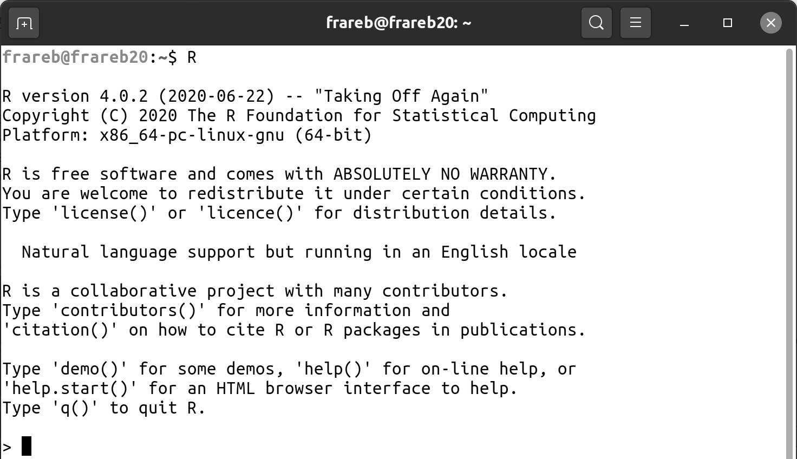

# (PART) Concepts de base {-}

# Premiers pas {#premiersPas}

\minitoc

## Installation de R

Le programme permettant l'installation du logiciel R peut être téléchargé depuis le site web de R : https://www.r-project.org/. Sur le site de R il faut au préalable choisir un miroir CRAN (serveur depuis lequel télécharger R ; sauf cas particulier le plus proche de sa localisation géographique), puis télécharger le fichier *base* correspondant à son système d'exploitation. Les utilisateurs de Linux pourront préférer un `sudo apt-get install r-base` (ou équivalent). 

Le logiciel R peut être téléchargé depuis de nombreux serveurs du CRAN (Comprehensive R Archive Network) à travers le monde. Ces serveurs s'appellent des miroirs. Le choix du miroir est manuel. 

## R comme calculatrice

Une fois le programme lancé, une fenêtre apparaît dont l'aspect peut varier en fonction de votre système d'exploitation (Figure \@ref(fig:screenCapConsole)). Cette fenêtre est dénommée la *console*. La première information que l’on peut trouver sur la console est la version de R utilisée. Il est recommandé de mettre à jour régulièrement sa version de R afin de bénéficier des dernières fonctionnalités. Au moment d’écrire ce livre, la version disponible est la 4.0.2 dénommée "Taking Off Again".

```{r screenCapConsole, fig.cap = "Capture d'écran de la console R sous Linux Ubuntu.\\label{fig:screenCapConsole}", echo = FALSE, out.width = '100%'}

```

La console correspond à l'interface où va être interprété le code, c'est à dire à l'endroit depuis lequel le code va être transformé en langage machine, puis exécuté par l'ordinateur. Le résultat de cette exécution sera retransmis dans la console sous une forme lisible par des humains. Cela correspond à l'écran d'affichage d'une calculatrice. C'est de cette manière que R va être utilisé dans la suite de cette section.

Tout au long de ce livre, les exemples de code R apparaîtront sur fond en gris. Ils peuvent être copiés et collés directement dans la console (pour la version électronique de ce livre, et alternativement depuis le site web https://www.dunod.com/), bien qu'il soit préférable de reproduire soit même les exemples dans la console (ou plus tard dans les scripts). Le résultat de ce qui est envoyé dans la console apparaîtra sur fond en blanc avec `##` devant le code afin de bien faire la distinction entre le code et le résultat du code.

### Les opérateurs arithmétiques {#l011opari}

```{r 011-conceptBase-1}
5 + 5
```

Si nous écrivons `5 + 5` dans la console puis la touche du clavier `Entrée`, le résultat apparaît précédé du chiffre [1] entre crochets. Ce chiffre correspond au numéro du résultat (dans notre cas, il n'y a qu'un seul résultat ; nous reviendrons sur cet aspect plus tard). Nous pouvons également noter dans cet exemple l'utilisation d'espaces avant et après le signe `+`. Ces espaces ne sont pas nécessaires mais permettent au code d'être plus lisible par les humains (i.e., plus agréable à lire pour nous comme pour les personnes avec qui nous serons amenés à partager notre code). 
Les opérateurs arithmétiques disponibles sous R sont résumés dans la table \@ref(tab:tabOpAri).

```{r tabOpAri, echo = FALSE}
opAriDf <- data.frame(Label = c("Addition", "Soustraction", "Multiplication", 
  "Division", "Puissance", "Modulo", "Quotient Décimal"), 
  Opérateur = c(" + ", " - ", " * ", "/", "^", "%%", "%/%"), 
  Exemple = c("5 + 5", "5 - 5", "5*5", "5/5", "5^5", "5 %% 5", "5 %/% 5"), 
  Résultat = c("10", "0", "25", "1", "3125", "0", "1"))
knitr::kable(opAriDf, caption = "Opérateurs arithmétiques.\\label{tab:tabOpAri}")
```

Classiquement, les multiplications et les divisions sont prioritaires sur les additions et les soustractions. Au besoin nous pouvons utiliser des parenthèses.

```{r 011-conceptBase-2}
5 + 5 * 2
(5 + 5) * 2
```

L'opérateur modulo correspond au  reste de la division euclidienne. Il est souvent utilisé en informatique par exemple pour savoir si un nombre est pair ou impair (un nombre modulo 2 va renvoyer 1 si il est impair et 0 si il est pair).

```{r 011-conceptBase-3}
451 %% 2
288 %% 2
(5 + 5 * 2) %% 2
((5 + 5) * 2) %% 2
```

R intègre également certaines constantes comme `pi` (3.141593). Par ailleurs le signe infini est représenté par `Inf`.

```{r 011-conceptBase-4}
pi
pi * 5^2
1/0
```

Le *style* du code est important car le code est destiné à être lisible par nous plus tard et par d'autres personnes de manière générale. Pour avoir un style lisible il est recommandé de mettre des espaces avant et après les opérateurs arithmétiques (bonnes pratiques de programmation). 

### Les opérateurs de comparaison {#l011opcomp}

R est cependant bien plus qu'une simple calculatrice puisqu'il permet un autre type d'opérateurs : les opérateurs de comparaison. Ils servent comme leur nom l'indique à *comparer* des valeurs entre elles (Table \@ref(tab:tabOpCom)).

```{r tabOpCom, echo = FALSE}
opAriDf <- data.frame(Label = c("plus petit que", "plus grand que", "plus petit ou égal à",  "plus grand ou égal à", "égal à", "différent de"), 
  Opérateur = c("<", ">", "<=", ">=", "==", "!="), 
  Exemple = c("5 < 5", "5 > 5", "5 <= 5", "5 >= 5", "5 == 5", "5 != 5"), 
  Résultat = c("FALSE", "FALSE", "TRUE", "TRUE", "TRUE", "FALSE"))
knitr::kable(opAriDf, caption = "Opérateurs de comparaison.\\label{tab:tabOpCom}")
```

Par exemple si nous voulons savoir si un chiffre est plus grand qu'un autre, nous pouvons écrire :

```{r 011-conceptBase-5}
5 > 3 
```

R renvoie la valeur `TRUE` si la comparaison est vraie et `FALSE` si la comparaison est fausse.

```{r 011-conceptBase-6}
5 > 3
2 < 1.5
2 <= 2
3.2 >= 1.5
```

Nous pouvons combiner les opérateurs arithmétiques avec les opérateurs de comparaison.

```{r 011-conceptBase-7}
(5 + 8) > (3 * 45/2) 
```

Dans la comparaison `(5 + 8) > (3 * 45/2)` les parenthèses ne sont pas nécessaires mais elles permettent au code d'être plus facile à lire.

Un opérateur de comparaison particulier est *égal à*. Nous verrons dans la section suivante que le signe `=` est réservé à un autre usage : il permet d'affecter une valeur à un objet. L'opérateur de comparaison *égal à* doit donc être différent, c'est pour cela que R utilise `==`. 

```{r 011-conceptBase-8}
42 == 53
58 == 58
```

Un autre opérateur particulier est *différent de*. Il est utilisé avec *un point d'exclamation* suivi de *égal*, `!=`. Cet opérateur permet d'obtenir la réponse inverse à `==`.

```{r 011-conceptBase-9}
42 == 53
42 != 53
(3 + 2) != 5
10/2 == 5
```

R utilise `TRUE` et `FALSE` qui sont aussi des valeurs qui peuvent être testées avec les opérateurs de comparaison. Mais R attribue également une valeur à `TRUE` et `FALSE` :

```{r 011-conceptBase-10}
TRUE == TRUE
TRUE > FALSE
1 == TRUE
0 == FALSE
TRUE + 1
FALSE + 1
(FALSE + 1) == TRUE
```

La valeur de `TRUE` est de 1 et la valeur de `FALSE` est de 0. Si cela peut paraître étrange à ce stade, nous verrons plus tard comment utiliser cette information et toutes les fonctionnalités qu’elle permet.

R est aussi un langage relativement permissif, cela veut dire qu'il admet une certaine flexibilité dans la manière de rédiger le code. Débattre du bien-fondé de cette flexibilité sort du cadre de ce livre mais nous pourrons trouver dans du code R sur Internet ou dans d'autres ouvrages les raccourcis `T` pour `TRUE` et `F` pour `FALSE`. 

```{r 011-conceptBase-11}
T == TRUE
F == FALSE
T == 1
F == 0
(F + 1) == TRUE
```

Bien que cette façon de se référer à `TRUE` et `FALSE` par `T` et `F` soit assez répandue, dans ce livre nous utiliserons toujours `TRUE` et `FALSE` afin que le code soit plus facile à lire. Encore une fois l'objectif d'un code est de non seulement être fonctionnel mais aussi d'être facile à lire et à relire. De plus, il est possible -bien que non recommandé- de créer une variable `T` et de lui affecter la valeur `FALSE` (cf. la notion d'objet que nous verrons plus tard). L'utilisation de `TRUE` et `FALSE` permet d'éviter ce problème.

```{r 011-conceptBase-11b}
print(T)
T <- FALSE
print(T)
```

```{r 011-conceptBase-11c, echo=FALSE}
rm(T)
```

### Les opérateurs logiques {#l011oplog}

Il existe un dernier type d'opérateur, les opérateurs logiques. Ils sont utiles pour combiner des opérateurs de comparaison (Table \@ref(tab:tabOpLog)). 

```{r tabOpLog, echo = FALSE}
opAriDf <- data.frame(Label = c("n'est pas", "et", "ou", "ou exclusif"), 
  Opérateur = c("!", "&", "|", "xor()"))
knitr::kable(opAriDf, caption = "Opérateurs logiques.\\label{tab:tabOpLog}")
```

```{r 011-conceptBase-12}
!TRUE
!FALSE
((3 + 2) == 5) & ((3 + 3) == 5)
((3 + 2) == 5) & ((3 + 3) == 6)
(3 < 5) & (5 < 5)
(3 < 5) & (5 <= 5)
```

L'opérateur logique `xor()` correspond à un *ou exclusif*. C'est à dire que l'un des deux **arguments** de la **fonction** `xor()` doit être vrai, mais pas les deux. Nous reviendrons plus tard sur les **fonctions** et leurs **arguments**, mais retenons que l'on identifie une fonction par ses parenthèses qui contiennent des arguments séparés par des virgules.

```{r 011-conceptBase-13}
xor((3 + 2) == 5, (3 + 3) == 6)
xor((3 + 2) == 5, (3 + 2) == 6)
xor((3 + 3) == 5, (3 + 2) == 6)
xor((3 + 3) == 5, (3 + 3) == 6)
```

Il est recommandé que les virgules (`,`) soient suivies par un espace afin que le code soit plus agréable à lire. Cela fait beaucoup de recommandations sur le style du code qui peuvent sembler à ce stade superflues. Néanmoins il est important d’adopter de bonnes pratiques de programmation dès le début de notre apprentissage de R (il est toujours plus facile de prendre de bonnes habitudes que de devoir corriger de mauvaises habitudes par la suite).

### Aide sur les opérateurs

Le fichier d'aide en anglais sur les opérateurs arithmétiques peut être obtenu avec la commande `?'+'`. Le fichier d'aide sur les opérateurs de comparaison peut être obtenu avec la commande `?'=='` et celui sur les opérateurs logiques avec la commande `?'&'`.

## La notion d'objet {#l011object}

Un aspect important de la programmation avec R, mais aussi de la programmation en général est la notion d'objet. Dans les exemples utilisés jusqu'à présent, les résultats étaient affichés dans la console mais "perdus" pour l'utilisateur car pas stockés en mémoire. Les objets vont permettre de pallier ce problème. Comme indiqué sur la page web de wikipedia (https://fr.wikipedia.org/wiki/Objet_(informatique)), en informatique, un objet est un *conteneur*, c'est à dire quelque chose qui va contenir de l'information. L'information contenue dans un objet peut être très variée, mais pour le moment nous allons contenir dans un objet le chiffre 5. Pour ce faire (et pour pouvoir le réutiliser par la suite), il nous faut donner un nom à notre objet. Avec R, le nom des objets ne doit pas comprendre de caractères spéciaux comme *^$?|+()[]}{*, et ne doit ni commencer par un chiffre, ni contenir d'espaces. Le nom de l'objet doit être représentatif de ce qu'il contient, tout en étant ni trop court ni trop long. Imaginons que notre chiffre 5 corresponde au nombre de répétitions d'une expérience. Nous voudrions lui donner un nom faisant référence à *nombre* et à *répétition*, que nous pourrions réduire à *nbr* et *rep*, respectivement. Il existe plusieurs possibilités qui sont toutes assez répandues sous R : 

* la séparation au moyen du caractère *tiret bas* :  `nbr_rep`
* la séparation au moyen du caractère *point* : `nbr.rep`
* l'utilisation de lettres minuscules : `nbrrep`
* le style *lowerCamelCase* consistant en un premier mot en minuscules et des suivants avec une majuscule : `nbrRep`
* le style *UpperCamelCase* consistant à mettre une majuscule au début de chacun des mots : `NbrRep`

Toutes ces formes de nommer un objet sont équivalentes. De manière générale il faut éviter les noms trop longs comme `leNombreDeRepetitions` ou trop courts comme `nR`, et les noms ne permettant pas d'identifier le contenu comme `maVariable` ou `monChiffre`, mais aussi `a` ou `b`...

Il existe différentes façons de définir un nom pour les objets que nous allons créer avec R. Dans ce livre nous utilisons le style *lowerCamelCase*. L'important n'est pas le choix du style mais la consistance dans son choix. L'objectif est d'avoir un code fonctionnel mais également un code facile et agréable à lire pour soi et pour les autres.

Maintenant que nous avons choisi un nom pour notre objet, il faut le créer et faire comprendre à R que notre objet doit contenir le chiffre 5. Il existe trois façons de créer un objet sous R et de lui assigner un contenu:

* avec le signe `<-`
* avec le signe `=`
* avec le signe `->`

```{r 011-conceptBase-14}
nbrRep <- 5
nbrRep = 5
5 -> nbrRep
```

Dans ce livre nous utiliserons toujours la forme `<-` par souci de consistance et aussi parce que c'est la forme la plus répandue.

```{r 011-conceptBase-15}
nbrRep <- 5
```

Nous venons de créer un objet `nbrRep` et de lui affecter la valeur 5. Cet objet est désormais disponible dans notre environnement de calcul et peut donc être utilisé. Voici quelques exemples :

```{r 011-conceptBase-16}
nbrRep + 2
nbrRep * 5 - 45/56
pi * nbrRep^2
```

La valeur associée à notre objet `nbrRep` peut être modifiée de la même manière que lors de sa création :

```{r 011-conceptBase-17}
nbrRep <- 5
nbrRep + 2
nbrRep <- 10
nbrRep + 2
nbrRep <- 5 * 2 + 7/3
nbrRep + 2
```

L'utilisation des objets prend tout son sens lorsque nous avons des opérations complexes à réaliser et rend le code plus agréable à lire et à comprendre. 

```{r 011-conceptBase-18}
(5 + 9^2 - 1/18) / (32 * 45/8 + 3)
terme01 <- 5 + 9^2 - 1/18
terme02 <- 32 * 45/8 + 3
terme01 / terme02
```

## Les scripts

R est un langage de programmation souvent dénommé *langage de script*. Cela fait référence au fait que la plupart des utilisateurs vont écrire des petits bouts de code plutôt que des programmes entiers. R peut être utilisé comme une simple calculatrice, et dans ce cas il ne sera pas nécessaire de conserver un historique des opérations qui ont été réalisées. Mais si les opérations à réaliser sont longues et complexes, il peut devenir nécessaire de pouvoir sauvegarder ce qui a été fait à un moment donné pour pouvoir poursuivre plus tard. Le fichier dans lequel seront conservées les opérations constitue ce que l'on appelle communément le script. Un script est donc un fichier contenant une succession d'informations compréhensibles par R et qu'il est possible d'exécuter. Les scripts sont indispensables pour répéter les analyses (reproductibilité des résultats), pour échanger avec ses collègues, ou pour faire des analyses sur un serveur. Les scripts sont par ailleurs des documents qui trouvent de plus en plus leur place dans les annexes des articles scientifiques, assurant ainsi la transparence et la reproductibilité des résultats (et la réutilisation des méthodes).

### Créer un script et le documenter

Pour ouvrir un nouveau script il suffit de créer un fichier texte vide qui sera édité par un éditeur de texte comme le *bloc note* sous Windows ou Mac OS, ou encore *Gedit* ou même *nano* sous Linux. Par convention ce fichier prend l'extension ".r" ou plus souvent ".R". C'est cette dernière convention qui sera utilisée dans ce livre. Depuis l'interface graphique de R il est possible de créer un nouveau script sous Mac OS et Windows via *fichier* puis *nouveau script* et *enregistrer sous*.
Tout comme le nom des objets, le nom du script est important pour que nous puissions facilement identifier son contenu. Par exemple nous pourrions créer un fichier `formRConceptsBase.R` contenant les objets que nous venons de créer et les calculs effectués. Mais même avec des noms de variables et un nom de fichier bien définis, il sera difficile de se rappeler le sens de ce fichier sans une documentation accompagnant le script. Pour documenter un script nous allons utiliser des *commentaires*. Les commentaires sont des éléments qui seront identifiés par R et qui ne seront pas exécutés. Pour spécifier à R que nous allons faire un commentaire, il faut utiliser le caractère octothorpe (croisillon ; différent du caractère dièse) `#`. Les commentaires peuvent être insérés sur une nouvelle ligne ou en fin de ligne.

```{r 011-conceptBase-19}
# création objet nombre de répétitions
nbrRep <- 5 # commentaire de fin de ligne
```

Les commentaires peuvent aussi être utilisés pour qu'une ligne ne soit plus exécutée.

```{r 011-conceptBase-20}
nbrRep <- 5
# nbrRep + 5
```

Pour en revenir à la documentation du script, il est recommandé de commencer chacun de ses scripts par une brève description de son contenu, puis lorsque le script devient long, de le structurer en différentes parties pour faciliter sa lecture.

```{r 011-conceptBase-21}
# ------------------------------------------------------------
# Voici un script pour acquérir les concepts de base 
# avec R
# date de création : 25/06/2018
# date de modification : 31/08/2020
# auteur : Jean Petit
# ------------------------------------------------------------

# [1] création de l'objet nombre de répétitions
# ------------------------------------------------------------

nbrRep <- 5

# [2] calculs simples
# ------------------------------------------------------------

pi * nbrRep^2
```

Pour aller plus loin sur le style de code, un guide de recommandations est disponible en ligne sur le site de tidyverse (en anglais ; http://style.tidyverse.org/). Nous verrons que ce livre suit les principales recommandations de ce site, mais pas toutes car notre préoccupation principale est d’avoir un code lisible et reproductible.

### Exécuter un script

Depuis que nous avons un script, nous ne travaillons plus directement dans la console. Or seule la console est capable d'interpréter le code R et de nous renvoyer les résultats que nous souhaitons obtenir. Pour l'instant la technique la plus simple consiste à copier-coller les lignes que nous souhaitons exécuter depuis notre script vers la console. A partir de maintenant nous n'allons plus utiliser les éditeurs de texte comme le bloc note mais des éditeurs spécialisés pour la confection de scripts R. C'est l'objet du chapitre suivant.

## Conclusion

Félicitations, nous avons atteint la fin de ce premier chapitre sur les éléments de base de R. Nous savons:

* Installer R
* Utiliser R comme une calculatrice
* Créez des **objets** et les utiliser pour les calculs arithmétiques, les comparaisons et les tests logiques
* Choisir des noms pertinents pour les objets
* Créer de nouveaux **scripts**
* Choisir un nom pertinent pour les fichiers de script
* Exécuter le code d'un script
* Documenter les scripts avec des **commentaires**
* Utiliser un style de code pour le rendre agréable à lire et facile à comprendre
