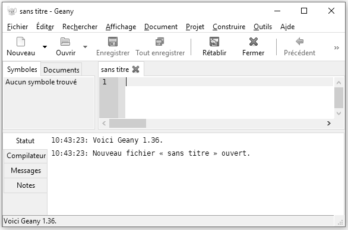

# Choisir un environnement de développement {#IDE}

## Editeurs de texte et environnement de développement

Il existe de très nombreux éditeurs de texte, le chapitre précédent a permit d'en introduire quelque uns parmis les plus simples comme le bloc note de Windows. Rapidement les limites de ces éditeurs ont rendu la tâche d'écrire un script fastidieuse. En effet, même en structurant son script avec des commentaires, il reste difficile de se répérer dans celui-ci. C'est là qu'interviennent les éditeurs de texte spécialisés qui vont permettre une écriture et une lecture agréable et simplifiée. 
L'éditeur de texte pour R certqinement le plus répandu est Rstudio, mais il en existe bien d'autres. Faire une liste exhaustive de toutes les solutions disponibles sort du cadre de ce livre, ainsi nous nous focaliserons sur les trois solutions que j'utilise au quotidien que sont **Notepad++**, **Rstudio**, et **Geany**.


## RStudio

```{r logoRStudio, fig.cap = "Logo RStudio.\\label{fig:logoRStudio}", echo = FALSE}

```

### Installer RStudio

Le programme pour installer Rstudio se retrouve dans la partie *Products* du site web de Rstudio (https://www.rstudio.com/). Nous allons installé RStudio pour un usage local (sur notre ordinateur), donc la version qui nous intéresse est *Desktop*. Nous allons utiliser la version *Open Source* qui est gratuite. Ensuite il nous suffit de sélectionner la version qui correspond à notre système d'exploitation, de télécharger le fichier correspondant et de l'exécuter pour lancer l'installation. Nous pouvons conserver les options par défaut tout au long de l'installation. 

### Un script avec RStudio

Nous pouvons alors ouvrir RStudio. Lors de la première ouverture, l'interface est divisée en deux avec à gauche la console R que nous avons vu au chapitre précédent (Figure \@ref(fig:screenCapRStudio01)). Pour ouvrir un nouveau script, nous allons dans le menu *File*, *New File*, *R script*. Par défaut ce fichier a comme nom *Untitled1*. Nous avons vu au chapitre précédent l'importance de donner un nom pertinent à nos scripts, c'est pourquoi nous allons le renommer *selecEnvDev.R*, dans le menu *File*, avec l'option *Save As...*. 
Nous avons pu noter que la partie gauche de RStudio est désormais séparée en deux, avec en bas de l'écran la console et en haut de l'écran le script. 

```{r screenCapRStudio01, fig.cap = "Capture d'écran de RStudio sous Windows : fenêtre par défaut.\\label{fig:screenCapRStudio01}", echo = FALSE}
knitr::include_graphics("myFigures/screencap_RStudio_01.png")
```

Nous pouvons alors commencer l'écriture de notre script avec les commentaires décrivant ce que nous allons y trouver, et y ajouter un calcul simple. Une fois que nous avons recopier le code suivant, nous pouvons sauver notre script avec la commande `CTRL + S` ou en se rendant dans *File*, puis *Save*.

```{r}
# ------------------------------------------------------------
# Un script para seleccionar su entorno de desarrollo
# fecha de creación : 27/06/2018
# autor : François Rebaudo
# ------------------------------------------------------------

# [1] cálculos simples
# ------------------------------------------------------------
nbrRep <- 5
pi * nbrRep^2
```

Pour exécuter notre script, il suffit de sélectionner les lignes que nous souhaitons exécuter et d'utiliser la combinaison de touches `CTRL + ENTER`. Le résultat apparaît dans la console (Figure \@ref(fig:screenCapRStudio02)).

```{r screenCapRStudio02, fig.cap = "Capture d'écran de RStudio sous Windows : exécuter un script avec CTRL + ENTER.\\label{fig:screenCapRStudio02}", echo = FALSE}
knitr::include_graphics("myFigures/screencap_RStudio_02.png")
```

Nous pouvons voir que par défaut dans la partie du script les commentaires apparaissent en vert, les chiffres en bleu, et le reste du code en noir. Dans la partie de la console ce qui a été exécuté apparaît en bleu et les résultats de l'exécution en noir.
Nous pouvons également noter que dans la partie du code chaque ligne comporte un numéro correspondant au numéro de ligne à gauche sur fond gris. Il s'agit de la coloration syntaxique par défaut avec RStudio. Cette coloration syntaxique peut être modifiée en se rendant dans le menu *Tools*, *Global Options...*, *Appearance*, puis en choisissant un autre thème dans la liste *Editor theme:*. Nous allons choisir le thème *Cobalt*, puis *OK* (Figure \@ref(fig:screenCapRStudio03)). 

```{r screenCapRStudio03, fig.cap = "Capture d'écran de RStudio sous Windows : changer les paramètres de coloration syntaxique.\\label{fig:screenCapRStudio03}", echo = FALSE}
knitr::include_graphics("myFigures/screencap_RStudio_03.png")
```

Nous savons comment créer un nouveau script, le sauvegarder, exécuter son contenu, et changer l'apparence de RStudio. Nous verrons les nombreux autres avantages de RStudio tout au long de ce livre car c'est l'environnement de développement qui sera utilisé. Nous serons néanmois particulièrement vigilents à ce que tous les scripts développés tout au long de ce livre s'exécute de la même façon quel que soit l'environnement de développement utilisé. 

## Notepad++ avec Npp2R

```{r logoNotepad, fig.cap = "Logo Notepad++\\label{fig:logoNotepad}", echo = FALSE}

```

### Installer Notepad++ (pour Windows uniquement)

Le programme pour installer Notepad++ se trouve dans l'onglet *Downloads* (https://notepad-plus-plus.org/download/). Vous pouvez choisir entre la version 32-bit et 64-bit (64-bit si vous ne savez pas quelle version choisir). Notepad++ seul est suffisant pour écrire un script, mais il est encore plus puissant avec *Notepad to R* (*Npp2R*) qui permet d'exécuter automatiquement nos script dans une console en local sur notre ordinateur ou à distance sur un serveur.

### Installer Npp2R

Le programme pour installer Npp2R est hébergé sur le site de Sourceforge (https://sourceforge.net/projects/npptor/). Npp2R doit être installé après Notepad++.

### Un script avec Notepad++

Lors de la première ouverture Notepad++ affiche un fichier vide *new 1* (Figura \@ref(fig:screenCapNpp01)). 

```{r screenCapNpp01, fig.cap = "Capture d'écran de Notepad++ sous Windows : fenêtre par défaut.\\label{fig:screenCapNpp01}", echo = FALSE}
knitr::include_graphics("myFigures/screencap_Npp_01.png")
```

Puisque nous avons déjà créer un script pour le tester avec RStudio, nous allons l'ouvrir à nouveau avec Notepad++. Dans *Fichier*, selectionnons *Ouvrir...* puis choisir le script *selecEnvDev.R* créé précédemment. Une fois le script ouvert, allons dans *Langage*, puis *R*, et encore une fois *R*. La coloration syntaxique apparaît (Figura \@ref(fig:screenCapNpp02)).

```{r screenCapNpp02, fig.cap = "Capture d'écran de Notepad++ sous Windows : exécuter un script avec F8.\\label{fig:screenCapNpp02}", echo = FALSE}
knitr::include_graphics("myFigures/screencap_Npp_02.png")
```

L'execution du script ne peut se faire que si Npp2R est en cours d'exécution. Pour se faire il est nécessaire de lancer le programme Npp2R depuis l'invite de Windows. Un icône devrait apparaître en bas de votre écran. L'exécution automatique du code depuis Notepad++ se fait en sélectionnant le code à exécuter puis en utilisant la commande `F8`. Si la commande ne fonctionne pas et que vous venez d'installer Notepad++, il est peut être nécessaire de redémarrer votre ordinateur. Si la commande fonctionne, une nouvelle fenêtre va s'ouvrir avec une consol exécutant les lignes souhaitées (Figura \@ref(fig:screenCapNpp03).

```{r screenCapNpp03, fig.cap = "Capture d'écran de Notepad++ sous Windows : la console avec F8.\\label{fig:screenCapNpp03}", echo = FALSE}
knitr::include_graphics("myFigures/screencap_Npp_03.png")
```

Comme pour RStudio, la coloration syntaxique peut être modifiée depuis le menu *Paramètres*, et un nouveau thème peut être sélectionné (par exemple *Solarized* dans la Figura \@ref(fig:screenCapNpp04))

```{r screenCapNpp04, fig.cap = "Capture d'écran de Notepad++ sous Windows : coloration syntaxique avec le thème Solarized.\\label{fig:screenCapNpp04}", echo = FALSE}
knitr::include_graphics("myFigures/screencap_Npp_04.png")
```

Par rapport aux autres éditeurs de texte, Notepad++ a l'avantage d'être très léger et offre une vaste gamme d'options pour personnaliser l'écriture du code.

## Geany (pour Linux, Mac OSX et Windows)

```{r logoGeany, fig.cap = "Logo Geany\\label{fig:logoGeany}", echo = FALSE}

```

### Installer Geany

Le programme pour l'installation de Geany se trouve sous l'onglet *Downloads* dans le menu de gauche *Releases* de la page web (https://www.geany.org/). Ensuite il suffit de télécharger l'exécutable pour Windows ou le dmg pour Mac OSX. Les utilisateurs de Linux préfèrerons un `sudo apt-get install geany`. 

### Un script avec Geany

Lors de la première ouverture, comme pour RStudio et Notepad++, un fichier vide est créé (Figure \@ref(fig:screenCapGeany01)). 

```{r screenCapGeany01, fig.cap = "Capture d'écran de Geany sous Windows : fenêtre par défaut.\\label{fig:screenCapGeany01}", echo = FALSE}

```

Nous pouvons ouvrir notre script avec *Fichier*, *Ouvrir* (Figure \@ref(fig:screenCapGeany02)).

```{r screenCapGeany02, fig.cap = "Capture d'écran de Geany sous Windows : ouvrir un script.\\label{fig:screenCapGeany02}", echo = FALSE}
knitr::include_graphics("myFigures/screencap_Geany_02.png")
```

Pour exécuter notre script, la version de Geany pour Windows ne dispose pas d'un terminal intégré, ce qui rend son utilisation limitée sous ce système d'exploitation. L'exécution d'un script peut se faire en ouvrant R dans une fenêtre à part et en copiant et collant les lignes à exécuter. Sous Linux et Mac OSX, il suffit d'ouvrir R dans le terminal situé dans la partie basse de la fenêtre de Geany avec la commande `R`. Nous pouvons ensuite paramétré Geany pour qu'une combinaison de touches permette d'exécuter le code selectionné (par exemple `CTRL + R`). Pour cela il faut tout d'abord autoriser l'envoi de sélection vers le terminal (`send_selection_unsafe=true`) dans le fichier `geany.conf` puis choisir la commande d'envoi vers le terminal (dans *Editar*, *Preferencias*, *Combinaciones*).
Pour changer le thème de Geany, il existe une collection de thèmes accessibles sur GitHub (https://github.com/geany/geany-themes/). Le thème peut ensuite être changé via le menu *Ver*, *Cambiar esquema de color...* (un exemple avec le thème *Solarized*, Figure \@ref(fig:screenCapGeany03)). 

```{r screenCapGeany03, fig.cap = "Capture d'écran de Geany sous Windows : changer les paramètres de coloration syntaxique.\\label{fig:screenCapGeany03}", echo = FALSE}

```

## Autres solutions

Il existe beaucoup d'autres solutions, certaines spécialisées pour R comme **Tinn-R** (https://sourceforge.net/projects/tinn-r/), et d'autres plus généralistes pour la programmation comme **Atom** (https://atom.io/), **Sublime Text** (https://www.sublimetext.com/), **Vim** (https://www.vim.org/), **Gedit** (https://wiki.gnome.org/Apps/Gedit), **GNU Emacs** (https://www.gnu.org/software/emacs/), **Jupyter** (http://jupyter.org) ou encore **Brackets** (http://brackets.io/) et **Eclipse** (http://www.eclipse.org/).

## Conclusion

Felicitations, nous sommes arrivés au bout de ce chapitre sur environnements de développement pour utiliser R. Nous savons désormais :

* Installer RStudio, Geany ou Notepad++
* Reconnaître et choisir notre environnement préféré

A partir d'ici nous allons pouvoir nous concentrer sur le language de programmation R dans un environnement facilitant le travail de lecture et d'écriture du code. C'est un grand pas en avant pour maîtriser R.
