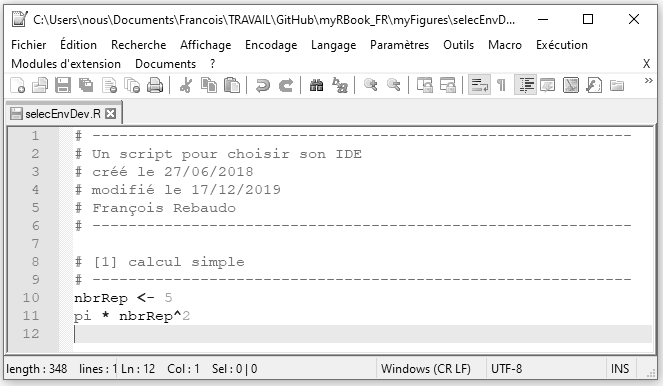
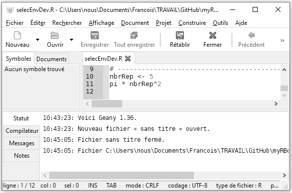

# Choisir un environnement de développement {#IDE}

\minitoc

## Éditeurs de texte et environnement de développement

\index{éditeur}

Il existe de très nombreux éditeurs de texte. Dans le chapitre précédent nous avons par exemple évoqué le **bloc note** de Windows qui figure parmi les plus simples. Mais ces éditeurs ont rapidement atteint leurs limites quant à l'écriture d'un script, celle-ci devenant trop fastidieuse. En effet, même en structurant son script avec des commentaires, il reste difficile de se repérer dans celui-ci. C'est là qu'interviennent les éditeurs de texte spécialisés qui permettent une écriture et une lecture agréable et simplifiée. 
L'éditeur de texte pour R le plus répandu est certainement **Rstudio**, mais il en existe bien d'autres. Nous ne dresserons pas une liste exhaustive de toutes les solutions disponibles dans ce livre, mais nous nous focaliserons sur les trois solutions que j'utilise au quotidien qui sont **Notepad++**, **Rstudio** et **Geany**. Certains éditeurs spécialisés proposent des outils soit disant pour **faciliter** certaines opérations comme la lecture de fichiers externes. Dans ce livre nous n'utiliserons **jamais** ces fonctionnalités car un script doit rester fonctionnel quel que soit l'éditeur de texte utilisé. Par exemple, un script édité avec RStudio devra être fonctionnel et modifiable avec Notepad++, Gedit ou Geany sans aucun problème, c'est même essentiel pour la reproductibilité des résultats. 

## RStudio

\index{RStudio}

```{r logoRStudio, fig.cap="Le logo de RStudio.\\label{fig:logoRStudio}", echo=FALSE}
knitr::include_graphics("myLogos/RStudio.png")
```

### Installer RStudio 

Le programme d'installation de **Rstudio** se retrouve dans la partie **Products** du site web de **Rstudio** (https://www.rstudio.com/). Nous allons installer RStudio pour un usage local (sur notre ordinateur), donc la version qui nous intéresse est **Desktop**. Nous allons utiliser la version **Open Source** qui est gratuite. Ensuite il nous suffit de sélectionner la version qui correspond à notre système d'exploitation, de télécharger le fichier correspondant et de l'exécuter pour lancer l'installation. Nous pouvons conserver les options par défaut tout au long de l'installation. 

### Écrire un script avec RStudio

\index{script}

Une fois l'installation faite, nous pouvons ouvrir RStudio. Lors de la première ouverture, l'interface est divisée en deux avec à gauche la console R que nous avons vue au chapitre précédent (Figure \@ref(fig:screenCapRStudio01)). Pour ouvrir un nouveau script, nous allons dans le menu **File**, **New File**, **R script**. Par défaut ce fichier a comme nom **Untitled1**. Nous avons vu au chapitre précédent l'importance de donner un nom pertinent à nos scripts, c'est pourquoi nous allons le renommer **selecEnvDev.R**, dans le menu **File**, avec l'option **Save As...**. 
Notons que la partie gauche de RStudio est désormais séparée en deux, avec au bas de l'écran la console et en haut de l'écran le script. 

```{r screenCapRStudio01, fig.cap = "Capture d'écran de RStudio sous Windows : fenêtre par défaut.\\label{fig:screenCapRStudio01}", echo = FALSE, out.width = '100%'}

```

Nous pouvons à présent commencer l'écriture de notre script avec les commentaires décrivant ce que nous allons y trouver, et y ajouter un calcul simple. Une fois que nous avons recopié le code suivant, nous pouvons sauvegarder notre script avec la commande `CTRL + S` ou en nous rendant dans **File**, puis **Save**.

```{r scriptTest, eval=FALSE}
# ------------------------------------------------------------
# Un script pour choisir son IDE
# créé le 27/06/2018
# modifié le 17/12/2019
# ------------------------------------------------------------

# [1] calcul simple
# ------------------------------------------------------------
nbrRep <- 5
pi * nbrRep^2
```

Pour exécuter notre script, il suffit de sélectionner les lignes que nous souhaitons exécuter et d'utiliser la combinaison de touches `CTRL + ENTER`. R va transformer notre code en langage compréhensible pour la machine (interprétation), puis l’exécuter. Le résultat de l’exécution est renvoyé sous forme lisible dans la console (Figure \@ref(fig:screenCapRStudio02)).

```{r screenCapRStudio02, fig.cap = "Capture d'écran de RStudio sous Windows : exécuter un script avec CTRL + ENTER.\\label{fig:screenCapRStudio02}", echo = FALSE, out.width = '100%'}

```

Nous pouvons voir dans la partie du script que les commentaires apparaissent en vert, les chiffres en bleu, et le reste du code en noir. Dans la partie de la console ce qui a été exécuté apparaît en bleu et les résultats de l'exécution en noir.
Nous pouvons également noter que dans la partie du code chaque ligne comporte un numéro correspondant au numéro de ligne à gauche sur fond gris. Il s'agit de la coloration syntaxique par défaut avec **RStudio**. Cette coloration syntaxique peut être modifiée en se rendant dans le menu **Tools**, **Global Options...**, **Appearance**, puis en choisissant un autre thème dans la liste **Editor theme**. Nous allons choisir le thème **Cobalt**, puis **OK** (Figure \@ref(fig:screenCapRStudio03)). 

```{r screenCapRStudio03, fig.cap = "Capture d'écran de RStudio sous Windows : changer les paramètres de coloration syntaxique.\\label{fig:screenCapRStudio03}", echo = FALSE, out.width = '100%'}

```

À ce stade nous savons créer un nouveau script, le sauvegarder, exécuter son contenu, et changer l'apparence de RStudio. Nous verrons les nombreux autres avantages de **RStudio** tout au long de ce livre car c'est l'environnement de développement qui sera utilisé. Nous serons néanmoins particulièrement vigilants à ce que tous les scripts développés dans ce livre s'exécutent de la même façon quel que soit l'environnement utilisé. 

## Notepad++ avec Npp2R

\index{Notepad++}

```{r logoNotepad, fig.cap = "Le logo de Notepad++\\label{fig:logoNotepad}", echo = FALSE}
knitr::include_graphics("myLogos/Notepadpp.png")
```

### Installer Notepad++ (pour Windows uniquement)

Le programme pour installer **Notepad++** se trouve dans l'onglet **Downloads** (https://notepad-plus-plus.org/download/). Vous pouvez choisir la version 32-bit ou la version 64-bit (choisir la version 64-bit si vous ne savez pas laquelle choisir). **Notepad++** seul est suffisant pour écrire un script, mais il est encore plus puissant avec **Notepad to R** (**Npp2R**) qui permet d'exécuter automatiquement nos scripts dans une console en local sur un ordinateur ou à distance sur un serveur.

### Installer Npp2R

Le programme pour installer **Npp2R** est hébergé par le site de Sourceforge (https://sourceforge.net/projects/npptor/). **Npp2R** doit être installé après **R** et après **Notepad++**.

### Écrire un script avec Notepad++

\index{script}

Lors de la première ouverture, **Notepad++** affiche un fichier vide **new 1** (Figure \@ref(fig:screenCapNpp01)). 

```{r screenCapNpp01, fig.cap = "Capture d'écran de Notepad++ sous Windows : fenêtre par défaut.\\label{fig:screenCapNpp01}", echo = FALSE, out.width = '100%'}

```

Puisque nous avons déjà créé un script pour le tester avec RStudio, nous allons l'ouvrir à présent avec **Notepad++**. Dans **Fichier**, sélectionnons **Ouvrir...** puis choisissons le script **selecEnvDev.R** créé précédemment. Une fois le script ouvert, allons dans **Langage**, puis **R**, et encore une fois **R**. La coloration syntaxique apparaît (Figure \@ref(fig:screenCapNpp02)).

```{r screenCapNpp02, fig.cap = "Capture d'écran de Notepad++ sous Windows : exécuter un script avec F8.\\label{fig:screenCapNpp02}", echo = FALSE, out.width = '100%'}

```

L'exécution du script ne peut se faire que si **Npp2R** est en cours d'exécution. Pour ce faire, il est nécessaire de lancer le programme **Npp2R** depuis l'invite de Windows. Un icône devrait apparaître en bas de votre écran. L'exécution automatique du code depuis Notepad++ se fait en sélectionnant le code à exécuter puis en utilisant la commande `F8`. Si la commande ne fonctionne pas et que vous venez d'installer Notepad++, il est peut être nécessaire de redémarrer votre ordinateur. Si la commande fonctionne, une nouvelle fenêtre va s'ouvrir avec une console renvoyant le résultat de l’exécution des lignes souhaitées (Figure \@ref(fig:screenCapNpp03)).

```{r screenCapNpp03, fig.cap = "Capture d'écran de Notepad++ sous Windows : la console avec F8.\\label{fig:screenCapNpp03}", echo = FALSE, out.width = '100%'}

```

Comme dans le cas de **RStudio**, la coloration syntaxique peut être modifiée depuis le menu **Paramètres**, et un nouveau thème peut être sélectionné (par exemple **Solarized** sur la Figure \@ref(fig:screenCapNpp04))

```{r screenCapNpp04, fig.cap = "Capture d'écran de Notepad++ sous Windows : coloration syntaxique avec le thème Solarized.\\label{fig:screenCapNpp04}", echo = FALSE, out.width = '100%'}

```

Si on le compare aux autres éditeurs de texte, **Notepad++** présente l'avantage d'être très léger et offre une vaste gamme d'options de personnalisation de l'écriture du code.

## Geany

\index{Geany}

```{r logoGeany, fig.cap = "Le logo de Geany\\label{fig:logoGeany}", echo = FALSE}
knitr::include_graphics("myLogos/Geany.png")
```

### Installer Geany

Le programme d'installation de **Geany** se trouve sous l'onglet **Downloads** dans le menu de gauche **Releases** de la page web https://www.geany.org/. Ensuite il suffit de télécharger l'exécutable pour Windows ou le dmg pour Mac OSX. Les utilisateurs de Linux préfèreront un `sudo apt-get install geany` (**Geany** est installé par défaut sur certaines distributions de Linux). 

### Écrire un script avec Geany

\index{script}

Lors de la première ouverture, comme dans le cas de *RStudio* et de *Notepad++*, un fichier vide est créé (Figure \@ref(fig:screenCapGeany01)). 

```{r screenCapGeany01, fig.cap = "Capture d'écran de Geany sous Windows : fenêtre par défaut.\\label{fig:screenCapGeany01}", echo = FALSE, out.width = '100%'}
knitr::include_graphics("myFigures/screencap_Geany_01.png")
```

Nous pouvons ouvrir notre script avec **Fichier**, **Ouvrir** (Figure \@ref(fig:screenCapGeany02)).

```{r screenCapGeany02, fig.cap = "Capture d'écran de Geany sous Windows : ouvrir un script.\\label{fig:screenCapGeany02}", echo = FALSE, out.width = '100%'}

```

Pour l'exécution de notre script, la version de **Geany** pour Windows ne dispose pas d'un terminal intégré, ce qui rend son utilisation limitée sous ce système d'exploitation. L'exécution d'un script peut se faire en ouvrant R dans une fenêtre à part et en copiant et collant les lignes à exécuter. Sous Linux et Mac OSX, il suffit d'ouvrir R dans le terminal situé dans la partie basse de la fenêtre de **Geany** avec la commande `R`. Nous pouvons ensuite paramétrer **Geany** pour qu'une combinaison de touches permette l'exécution du code sélectionné (par exemple `CTRL + R`). Pour cela il faut tout d'abord autoriser l'envoi de sélection vers le terminal (`send_selection_unsafe=true`) dans le fichier `geany.conf` puis choisir la commande d'envoi vers le terminal (dans **Edit**, **Preferences**, **Combinations**).
Pour changer le thème de **Geany**, il existe une collection de thèmes accessibles sur GitHub (https://github.com/geany/geany-themes/). Le thème peut ensuite être modifié via le menu **View**, **Change color theme...** (un exemple avec le thème **Solarized**, Figure \@ref(fig:screenCapGeany03)). 

```{r screenCapGeany03, fig.cap = "Capture d'écran de Geany sous Windows : modifier les paramètres de coloration syntaxique.\\label{fig:screenCapGeany03}", echo = FALSE, out.width = '100%'}
knitr::include_graphics("myFigures/screencap_Geany_03.png")
```

## Les autres solutions

Il existe beaucoup d'autres solutions, certaines spécialisées pour R comme **Tinn-R** (https://sourceforge.net/projects/tinn-r/), et d'autres plus généralistes pour la programmation comme **Atom** (https://atom.io/), **Sublime Text** (https://www.sublimetext.com/), **Vim** (https://www.vim.org/), **Gedit** (https://wiki.gnome.org/Apps/Gedit), **GNU Emacs** (https://www.gnu.org/software/emacs/), **Jupyter** (http://jupyter.org) ou encore **Brackets** (http://brackets.io/) et **Eclipse** (http://www.eclipse.org/).

## En bref

Félicitations, nous sommes arrivés au terme de ce chapitre sur les environnements de développement pour utiliser R. Nous savons désormais :

* installer **RStudio**, **Geany** ou **Notepad++**,
* reconnaître et choisir notre environnement préféré.

A présent, nous allons pouvoir nous concentrer sur le langage de programmation dans un environnement facilitant le travail de lecture et d'écriture du code. C'est un grand pas en avant pour maîtriser R.
