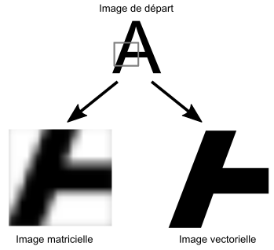

# Du graphique à la figure dans un article scientifique {#graph4}

\minitoc

\index{figure}

Une fois nos résultats obtenus, il est utile de les communiquer et ainsi de contribuer à la science. Cela peut se faire via des communications dans des congrès, via des posters, ou encore (et c’est le plus fréquent), via des articles scientifiques. Le choix de la revue sort du cadre de ce livre et les exemples montrés ici n’ont été choisi que pour mettre en évidence la diversité des règles à suivre en fonction des revues. 

Dans les articles scientifiques, les résultats graphiques prennent la forme de *figures* qui sont souvent le fruit de un ou plusieurs graphiques. Ces figures suivent des critères bien précis dictés par la revue. Prenons cet exemple adapté et traduit du guide de la revue PLoS :

*Les fichiers doivent être au format TIFF (avec compression LZW et une seule couche), ou EPS. Les dimensions doivent être de 789 à 2250 pixels et une hauteur maximum de 2625 pixels pour une résolution de 300 dpi (entre 6.68 et 19.05 cm de large - maximum 13.2 cm pour un alignement sur une colonne - et maximum 22.23 cm de haut). La police doit être Arial, Times, ou Symbol et d'une taille entre 8 et 12 points.*

Toutes ces contraintes peuvent être respectées avec R. Il existe en effet une série de fonctions destinées à la construction des figures (e.g., `pdf()`, `png()`, `tiff()`), avec les arguments pour ajuster la taille, le type de compression, etc. Lorsque les figures deviennent complexes avec des sous-éléments qui s'ajoutent à une figure existante, les choses se compliquent mais restent possible notamment grâce à des packages spécialisés. Néanmoins il peut s'avérer fastidieux de respecter ces contraintes avec R. C'est pourquoi nous allons utiliser des logiciels tiers pour transformer nos graphiques en figures. Afin de rester dans l'univers du libre et de l'*open source*, nous allons utiliser Inkscape pour la mise en page et Gimp pour la transformation dans les formats requis.

Quand on prend une photo, chaque pixel prend une valeur qui va définir la couleur du pixel, donc en zoomant sur une photo on va voir apparaître les pixels (nous perdons en netteté). C'est une image *matricielle*. Dans une image *vectorielle*, les éléments sont codés sous forme de segments, nous ne perdons pas en qualité car chaque élément conserve ses coordonnées (Figure \@ref(fig:matVec)). L'avantage des images vectorielles est que l'on peut modifier les éléments de l'image sans perdre en qualité. C'est ce que nous allons faire avec Inkscape. L'avantage des images matricielles est que l'on peut choisir entre de très nombreux formats (dont TIFF). C'est ce que nous allons faire avec Gimp.

```{r matVec, fig.cap = "Image matricielle et vectorielle.\\label{fig:matVec}", echo = FALSE}

```

## Inkscape

\index{Inkscape}

```{r logoInkscape, fig.cap = "Logo Inkscape (https://inkscape.org).\\label{fig:logoInkscape}", echo = FALSE, out.width = '30%'}

```

Inkscape est un logiciel de dessin vectoriel disponible sous Windows, Mac OS X et GNU/Linux. C'est un logiciel libre et open source sous licence GPL. Nous pouvons le télécharger à l'adresse suivante https://inkscape.org. Inkscape est déjà installé par défaut sur de nombreuses distributions de Linux. 

Expliciter toutes les fonctionnalités de Inkscape sort du cadre de ce livre, mais nous pourrons trouver de nombreux tutoriels en lignes pour rapidement maîtriser cet outil. Brièvement, pour respecter le guide de construction d'une figure d'une revue, nous allons tout d'abord construire notre figure *brute* sous R, puis l'exporter au format PDF à l'aide de la fonction `pdf()`. 

```{r ex1, eval=FALSE}
pdf("maFigure.pdf")
  plot(0)
dev.off()
```

Ensuite il nous suffira d'importer notre pdf sous Inkscape pour le modifier. Par défaut le PDF sera *groupé* en un seul élément. Pour accéder aux sous éléments de notre figure, nous pouvons dégrouper l'élément avec le raccourci `Ctrl+Shift+g`. Il est conseillé d'ajouter un fond blanc à notre figure pour éviter la transparence (un simple rectangle blanc sans bordure fera l'affaire). Une fois notre figure prête à être exportée, il nous faut la sauvegarder dans un fichier PNG avec le raccourci `Ctrl+Shift+e`, et passer à The Gimp.

## The Gimp

\index{Gimp}

```{r logoGimp, fig.cap = "Logo Gimp (https://www.gimp.org/).\\label{fig:logoGimp}", echo = FALSE, out.width = '30%'}

```

Gimp est un logiciel de dessin matriciel disponible sous Windows, Mac OS X et GNU/Linux. C'est un logiciel libre et open source sous licence GPL. Nous pouvons le télécharger à l'adresse suivante https://www.gimp.org/. Gimp signifie "GNU Image Manipulation Program". Gimp est déjà installé par défaut sur de nombreuses distributions de Linux. 

Nous allons importer notre fichier PNG puis tout simplement l'exporter dans un autre format avec le raccourci `Ctrl+Shift+e`. Une fenêtre nous proposera alors de choisir le nouveau format, par exemple TIFF avec une compression LZW. Notre figure est alors prête pour soumission.

## Table de référence

Voici une Table de référence (Table \@ref(tab:tabRefPub)) avec quelques revues illustrant la diversité des formats pour les figures scientifiques. 

```{r tabRefPub, echo = FALSE}
tabRef <- data.frame(
  Revue = c("PLoS", "PNAS", "Science"), 
  Largeur = c("6.68-19.05", "8.7; 11.4; 17.8", "9; 12.7; 18.4"), 
  Hauteur = c("max 22.23", "max 22.5", "NA"), 
  Format = c("TIFF, EPS", "TIF, EPS", "AI, EPS, PDF, TIF, JPEG"), 
  Resolution = c("300-600 dpi", "300 dpi", "300 dpi"), 
  Police = c("Arial, Times, Symbol", "Arial, Helvetica, Times, Symbol, Mathematical Pi, European Pi", "Helvetica"), 
  Taille = c("9-12", "min 6-8", "panel 10, axis 6-9, font 5"))
knitr::kable(tabRef, caption = "Table de référence pour la construction des figures.\\label{tab:tabRefPub}") %>%
  kable_styling(font_size = 8, latex_options = c("repeat_header")) %>% column_spec(c(2, 4, 6, 7), width = "5em")
```

## Conclusion

Ce chapitre est différent des autres car il ne traite pas directement de R. Il est néanmoins important car il montre une des nombreuses possibilités pour passer d’un graphique sous R à une figure dans un article scientifique. A l’usage de Inkscape et de Gimp, nous verrons rapidement que certaines modifications sont plus faciles à réaliser que sous R. Il s’agira alors de trouver le bon compromis entre R et ces deux logiciels pour la réalisation de nos figures. Il est bon de noter que les modifications apportées a posteriori ne sont pas reproductibles. Il faudra veiller à ce que les rendus sous R soit suffisant pour interpréter les données et assurer la reproductibilité des résultats. 
